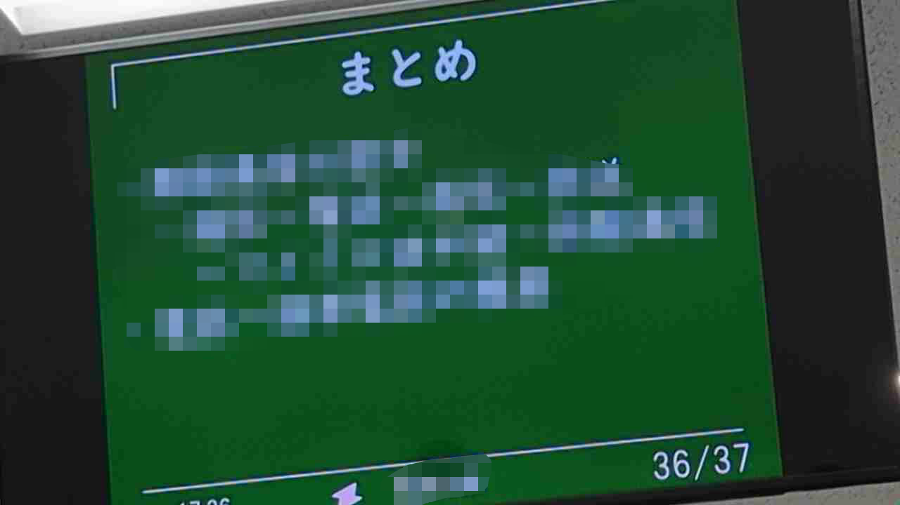
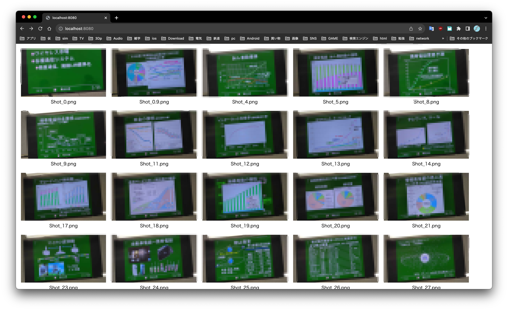

# SlideAutoShot
IPカメラでスライドが表示されている画面などを写し、画面が変わったら自動的に写真を撮るソフトです。Webサーバでの共有、PDF化も行えます。<br>
簡易的なwebサーバが含まれており、撮った写真をリアルタイムで共有することができます。<br>
pdf作成機も含まれており、撮った写真を簡単にpdf化&フォルダに格納することができます。<br>
<br>
difftime秒ごとに画像を取得し、一枚前の画像と色がcolor_similarity_rate㌫以上変わったピクセルが全体のpixel_rate㌫存在した場合、画像を保存します。<br>
macの方はpythonではなく、python3を使ってください<br>
一応、[PNSRを使ったもの](https://github.com/UnagiDojyou/SlideAutoShot/tree/PNSR)も作成しました。<br>

# 使い方
0. ライブラリのインストール
eportlab、Pillow、opencv-python、keyboardあたりが必要だと思います。pip installで入れてください。他にも必要なのがあるかもしれません。エラーを見て適宜インストールしてください<br>
1. カメラの設置
まず初めにカメラの位置をいい感じにします。下の画像くらいの感じでセットするとディフォルトの値で動作します。また、カメラが揺れると誤検知してしまうため、床に置くなど工夫してください。<br>
<br>
2. 自動ショットの実行
コマンドの使い方はこんな感じです。sですぐに撮影、qで終了できます。<br>
difftime、color_similarity_rate、pixel_rate(変数の意味は一番上の項に書いてある)はオプションで未指定では1、10、10です。
```
python SlideAutoShot.py IPカメラのURL difftime color_similarity_rate pixel_rate
```
3. Webサーバの立ち上げ
友達と撮った写真を共有したい場合は行ってください。URLはhttp://PCのIPアドレス:8080/です。<br>
下の写真のように写真のファイル名とサムネイルが表示されます。また、写真を押すとその画像が表示されます。<br>
<br>
Shot_x.png(xはfloat)なファイル名を表示可能です。xが小さい順に並ぶようになっているので、撮った写真が前後してしまった場合は小数のファイル名を利用してください。<br>
```
python myserver.py
```

4. ファイル整理
写真を一通り撮り終わった後、重複している写真や不足している写真を補ってください。なお、追加した写真はShot_x.png(xはfloat)というファイル法則に従ってください。そうでない場合pdf化されません。<br>

5. PDF化
PDFのファイル名を指定して実行すれば、自動でできます。pdfに追加されたpngファイルはpdfの名前のフォルダに自動的に移動します。<br>
```
python createpdf.py 任意の名前.pdf
```

# IPカメラに関して
Android勢はIP Webcam<br>
↳URLはhttp://IPアドレス:8080/video<br>
画像の位置の調整やズームが簡単にできるのでおすすめです。<br>

ios勢はDroidCam<br>
↳URLはhttp://IPアドレス:4747/video<br>
位置調整やズームが有料なので、無課金では変数をかなり頑張らないとうまく撮れないと思います。<br>
