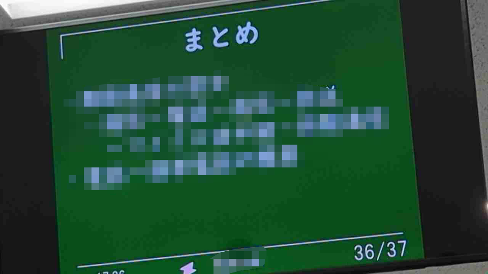

# SlideAutoShot
IPカメラでスライドが表示されている画面などを写し、画面が変わったら自動的に写真を撮るスクリプトです。<br>
1秒ごとに画像を取得し、一枚前の画像と色がcolor_similarity_rate㌫以上変わったピクセルが全体のpixel_rate㌫存在した場合、画像を保存します。

# 使い方
まず初めにカメラの位置をいい感じにします。下の画像くらいの感じでセットするとディフォルトの値で動作します。


```
SlideAutoShot.py IPカメラのURL color_similarity_rate pixel_rate
```
color_similarity_rateとpixel_rateはオプション(未指定では10と20)
```
SlideAutoShot.py http://192.168.0.10:8080/video
```

# IPカメラに関して
Android勢はIP Webcam<br>
↳URLはhttp://IPアドレス:8080/video<br>
画像の位置の調整やズームが簡単にできるのでおすすめです。

ios勢はDroidCam(今のところ動作しません)<br>
↳URLはhttp://IPアドレス:4747/video<br>
位置調整やズームが有料なので、無課金では変数をかなり頑張らないとうまく撮れないと思います。